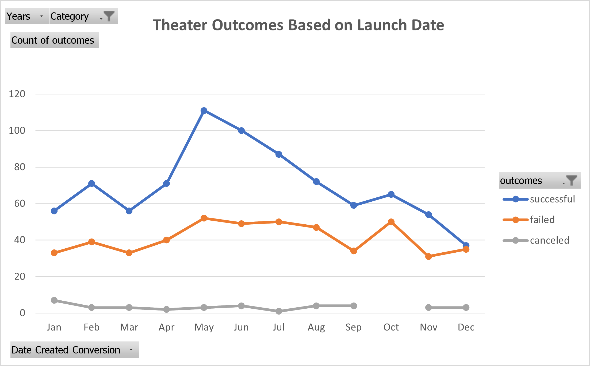
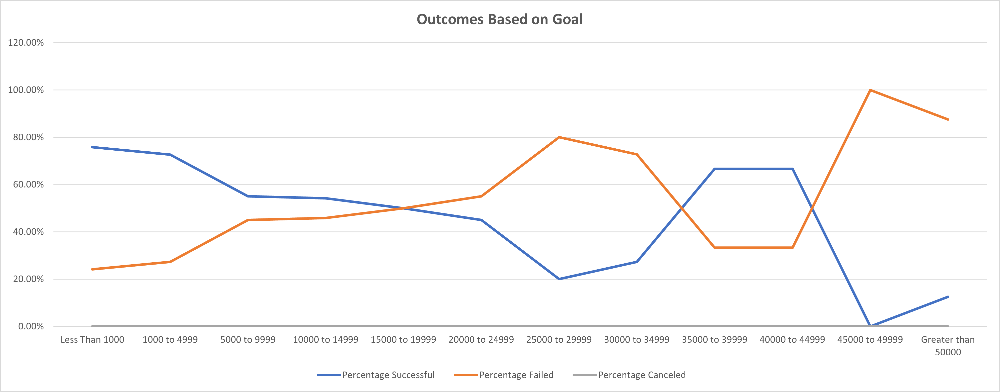

# Kickstarting with Excel

## Overview of Project

### Purpose

This project is aimed at providing a visual summary of outcomes of various kickstarter campaigns. The dataset covers consists of kickstarter campaigns in various categories for 19 countries mapped to four outcomes: "successful", "failed", "canceled" and "live". Each of these outcomes is measured based on the whether the specific kickstarter campaign reached their monetary fundraising goal between the launch date and the deadline. 

This project zooms in to focus on theater kickstarters and in particular, plays. I aim to provide a picture of the what launch month of the year resulted in the most success. In addition, looking at the outcomes from different goals mapped to the outcomes and pledged amounts, I aim to discover the most ideal goal to set for the most success.

## Analysis and Challenges

### Analysis of Outcomes Based on Launch Date

My first analysis focused on mapping the outcomes of all "theater" kickstarter campaigns to their launch date. Figure 1 below shows a visual of three of the campaign outcomes (“successful,” “failed,” and “canceled”) as requested by the client.

Key Analysis takeaways: 

- Throughout the months of the year, more theater kickstarters were successful than those that failed. 
- Theater kickstarters that were launched in May were the most successful.
- Kickstarters launched in the summer months (between May-July) appear to result the most success, while later winter months (November-December) see a drop. Further studies may be needed to determine why.
- A significantly low number of theater kickstarters were canceled. 

*Figure 1: Theater Outcomes Based on Launch Date*

### Analysis of Outcomes Based on Goals

My second analysis mapped the outcomes of all the "plays" kickstarter campaigns (a subcategory of theater) to their goals. Figure 2 below shows a visual of the percentage of the campaigns that were successful, failed, and “canceled”. The goals are visualized in  ranges to condense the data and make it more consumable. 

Key Analysis Takeaways:

- Plays that set their goals in the ranges of less than $1000 - $5000 and $35000 - $45000 saw the most success. 
- 88% of plays that set goals higher than $45000 failed. 
- None of the play kickstarter campaigns were canceled.

*Figure 2: Outcomes Based on Goal*

### Challenges and Difficulties Encountered

- In my analysis of play kickstarter campaigns, it was difficult to establish a conclusion regarding goals mapped to outcomes based on the data provided. Further analysis would be needed.
- The syntax format for the COUNTIFS formular and other coding exercises take some time to get used to. I was able use instructor resources, [Excel's official documentation](https://support.microsoft.com/en-us/office/countifs-function-dda3dc6e-f74e-4aee-88bc-aa8c2a866842?ui=en-us&rs=en-us&ad=us), online resources found through google, such as a [YouTube tutorial](https://www.youtube.com/watch?v=Ihkgs7T3Do0&ab_channel=TechOnTheNet) demonstrating the use of COUNTIFS. 

## Results

- What are two conclusions you can draw about the Outcomes based on Launch Date?

  - Throughout the months of the year, more theater kickstarters were successful than those that failed. 

  - Theater kickstarters that were launched in May were the most successful.

- What can you conclude about the Outcomes based on Goals?
  - Plays that set their goals in the ranges of less than $1000 - $5000 and $35000 - $45000 saw the most success. 
  - 88% of plays that set goals higher than $45000 failed. 
  - None of the play kickstarter campaigns were canceled.
- What are some limitations of this dataset?
  - In my analysis of play kickstarter campaigns, it was difficult to establish a conclusion regarding goals mapped to outcomes based on the data provided. Further analysis would be needed.
  - The data might be missing nuances such as popularity and location of the kickstarter, for example, a more popular play may succeed despite its goal. 
  - The dataset only goes until 2017 and will need to be updated for future use. 

- What are some other possible tables and/or graphs that we could create?
  - We could create a bar chart visualize all the parent categories and their outcomes to see which were the most successful kickstarter campaigns
  - We could expand the line chart of outcomes based on launch date to see if the rest of the kickstarters showed similar trends. 
